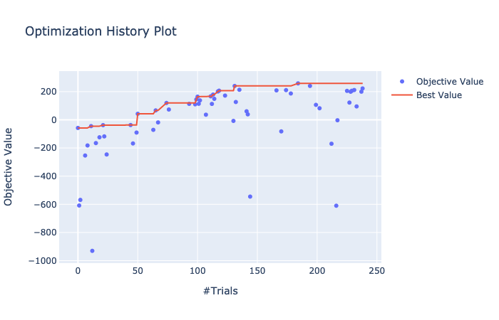

# Hyperparameter Tuning with Optuna

Tune hyperparameters by [Optuna](https://optuna.org/).

The example script (`optuna_dqn_obs1d.py`) uses fixed target algorithm/environment<sup>†</sup>
in order to fucus on the concept of Optuna-powered PFRL,
but you can create onr for your own use thanks to the Optuna's high flexibility.

†: DQN and environments with 1d continuous observation space and discrete action space


## How to Run

### Quickstart

Quickstart on your laptop

```bash
storage="sqlite:///example.db"
study="optuna-pfrl-quickstart"
pruner="HyperbandPruner"

# Higher score means better performance ("--direction maximize")
optuna create-study --study-name "${study}" --storage "${storage}" --direction maximize

# Start tuning hyper parameters
python optuna_dqn_obs1d.py --optuna-study-name "${study}" --optuna-storage "${storage}" --optuna-pruner "${pruner}"
```

You can see the optimization history of this study on [Jupyter Notebook](https://jupyter.org/install)
via [Optuna visualization module](https://optuna.readthedocs.io/en/latest/reference/visualization.html):

```python
# On jupyter notebook
import optuna

study_name = "optuna-pfrl-quickstart"
storage = "sqlite:///example.db"
study = optuna.load_study(study_name=study_name, storage=storage)

optuna.visualization.plot_optimization_history(study)
```




If you are interested in the `--optuna-pruner` argument above, see the
[corresponding Optuna document](https://optuna.readthedocs.io/en/latest/reference/pruners.html).


### Distributed Optimization

The quickstart script executed below can also be used as a "worker process" for parallel and distributed optimization.

#### Prerequisites

Since [SQLite is not recommended for parallel optimization](https://optuna.readthedocs.io/en/latest/tutorial/004_distributed.html#distributed-optimization),
we'll use PostgreSQL<sup>†</sup> instead of SQLite hereafter.  

†: You can select your favorite RDBMS as far as sqlalchemy (Optuna's backend library) supports.

- **Can access PostgreSQL** database named `${postgres_database}` running on a server `${host}`.
- Install `psycopg2` (PostgreSQL python wrapper) https://pypi.org/project/psycopg2/
  - `pip install psycopg2-binary` for installing stand-alone package
  - `pip install psycopg2` also works if you already [have PostgreSQL libraries on your machine](https://www.psycopg.org/docs/install.html#prerequisites).

#### Create a study

```bash
# Assue PostgreSQL running on a server ${host} with Database named ${database} is available.
postgres_user="user"
postgres_password="password"
postgres_host="host"
postgres_database="database"

storage="postgresql://${postgres_user}:${postgres_password}@${postgres_host}/${postgres_database}"
study="optuna-pfrl-distributed"
pruner="HyperbandPruner"

optuna create-study --study-name "${study}" --storage "${storage}" --direction maximize
```

#### Run the optimization

For parallel/distributed optimization, just run this script on any servers where PostgreSQL DB is accessible:

```bash
postgres_user="user"
postgres_password="password"
postgres_host="host"
postgres_database="database"

storage="postgresql://${postgres_user}:${postgres_password}@${postgres_host}/${postgres_database}"
study="optuna-pfrl-distributed"
pruner="HyperbandPruner"

# You can run two processes parallelly (If computation resource allows)
python optuna_dqn_obs1d.py --optuna-study-name "${study}" --optuna-storage "${storage}" --optuna-pruner "${pruner}" &
python optuna_dqn_obs1d.py --optuna-study-name "${study}" --optuna-storage "${storage}" --optuna-pruner "${pruner}" &
```
